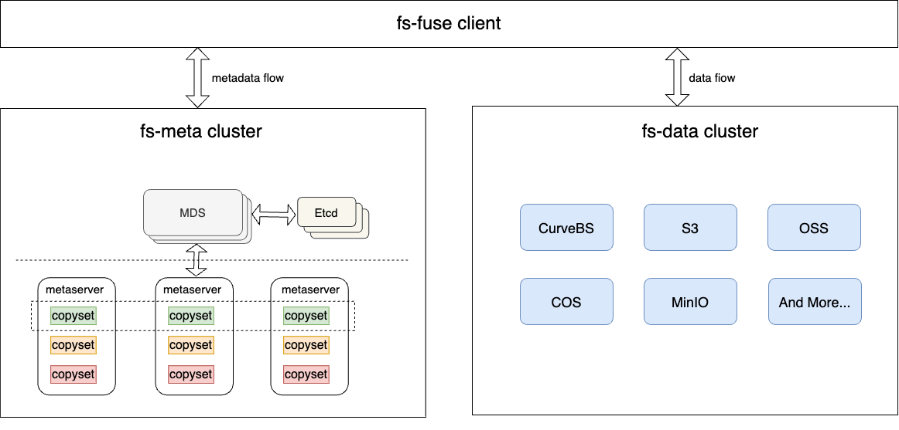

# Curve文件存储：百亿级文件支撑

## Curve文件存储
Curve文件存储是一个Posix兼容的分布式文件系统，适用于私有云、公有云、混合云环境。我们可以通过Curve文件存储轻松访问百亿级文件。

先对Curve文件存储的架构做一个简单的介绍。文件存储需要持久化的信息有两类，一类是文件的元数据，主要以inode和dentry为主，一类是文件的数据，即用户的写入内容。Curve文件系统在设计之初，考虑到多云的支持，以及在大规模数据场景下的成本（冷数据居多），需要支持数据在不同性能的存储中流转，因此选择了把元数据和数据分开存储。

下图是Curve文件系统的架构。
- 元数据使用单独的集群存储，保证高可靠、高可用、高可扩
- 数据则可以有多种选择，可以对接Curve块存储，对接公有云上的对象存储，也可以同时对接多种不同性能的存储，比如Curve块存储(SSD)、Curve块存储(HDD)、对象存储(三副本)、对象存储(EC)、对象存储(归档)。同样保证高可靠、高可用、高可扩。

## 如何支撑百亿级文件
Curve文件系统的重要特点之一就是适用于海量文件存储，那么Curve文件系统如何保证可以支撑百亿级规模？如何保证在百亿级规模下的性能？
从理论上来看：
- 规模方面，Curve文件存储的元数据集群，每个节点存储一定范围的inode(比如1~10000)和dentry，如果文件数量增多，可以进行存储节点的扩充，所以理论上规模是没有上限的。
- 性能方面，当文件数量很多时，对于单个文件的操作是没有什么差别的，但对于一些需要元数据的聚合操作会出现性能问题，比如du(计算当前文件系统的容量),ls(获取目录下所有文件信息)等操作，需要做一定的优化来保障性能。

那实际上Curve文件系统的表现如何呢？

首先介绍一下文件系统的几款通用测试工具。
1. [pjdfstest](https://github.com/pjd/pjdfstest): posix兼容性测试。有3600+个回归测试用例，覆盖chmod, chown, link, mkdir, mkfifo, open, rename, rmdir, symlink, truncate, unlink等
2. [mdtest](https://github.com/LLNL/mdtest): 元数据性能测试。对文件或者目录进行open/stat/close等操作，并返回报告
3. [vdbench](https://github.com/LLNL/mdtest): 数据一致性测试。Vdbench是Oracle编写的一款应用广泛的存储性能测试工具，既支持块设备的性能测试，也支持文件系统性能测试，在做随机写的一致性测试很方便，能实时检查出哪一个扇区出现了数据不一致
4. [fio](https://github.com/axboe/fio): 数据性能测试。

Curve文件系统从v2.3版本以后提供了单独压测元数据集群的方式（数据集群一般使用CurveBS和S3，所以直接对这些组件进行性能测试即可）。
1. 通过 [CurveAdm](https://github.com/opencurve/curveadm/wiki) 搭建文件系统，在准备客户端配置文件 [client.yaml](https://github.com/opencurve/curveadm/wiki/curvefs-client-deployment#%E7%AC%AC-3-%E6%AD%A5%E5%87%86%E5%A4%87%E5%AE%A2%E6%88%B7%E7%AB%AF%E9%85%8D%E7%BD%AE%E6%96%87%E4%BB%B6) 时新增配置项: [s3.fakeS3=true](https://github.com/opencurve/curve/blob/5df72f5e1e2813e4bfa5d73672ea0f6a25630e74/curvefs/conf/client.conf#L128)。
2. 使用 [mdtest](https://github.com/LLNL/mdtest)，[vdbench](https://www.oracle.com/downloads/server-storage/vdbench-downloads.html)，[ImagerNet数据集](https://www.kaggle.com/competitions/imagenet-object-localization-challenge/data) 作为数据源，测试大小文件混合场景下文件系统的稳定性和性能。

根据元数据的数据结构估算，百亿级文件的存储元数据逻辑空间大概需要8TB，实际存储使用3副本大概在24TB左右。有兴趣测试的小伙伴可以参考一下。

## 海量文件存储下性能如何

**Curve文件存储随着存量数据增长，性能可以相对保持平稳（stat请求的下降在15%左右）。**

场景1(测试目录个数较多的情况): 测试命令 mdtest -z 2 -b 3 -I 10000 -d /mountpoint

场景2(测试目录层级很深的情况): mdtest -z 10 -b 2 -I 100 -d /mountpoint

**Curve文件存储当前使用元数据集群，相对于使用分布式kv存储（如tikv）性能较优。**

说明：本组测试打开了 `fuseClient.enableMultiMountPointRename ` ，保证多挂载点rename的事务性，所以和上组的基础测试数据有偏差。

场景1(测试目录个数较多的情况): 测试命令 mdtest -z 2 -b 3 -I 10000 -d /mountpoint

场景2(测试目录层级很深的情况): mdtest -z 10 -b 2 -I 100 -d /mountpoint

当前，Curve文件存储已经在ES、AI场景落地，后续会有相应的案例分享给大家。