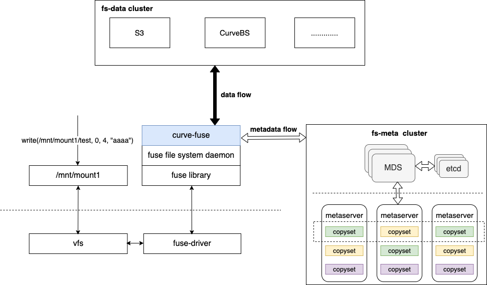

# curve 创建删除文件系统

- [curve 创建删除文件系统](#curve-创建删除文件系统)
  - [介绍](#介绍)
  - [创建文件系统](#创建文件系统)
  - [删除文件系统](#删除文件系统)
    - [mds](#mds)
    - [FsManager](#fsmanager)
    - [后台删除服务](#后台删除服务)

## 介绍

我们即将举办一个开发者活动：[[2023 Q2 Developer Activities]: Call For Participation！](https://github.com/opencurve/curve/issues/2334)。
活动的主题包括：新工具的开发、云原生部署和代码逻辑的调整。
为了大家更好的参与到活动中，我们将在这里介绍一下 Curve 的新工具，以及部分代码的实现。

curvefs 的新工具是一个基于Go语言的命令行工具，可以用来对整个 Curve 集群进行运维和查询等操作。
开发新工具是入门的好机会，只需要了解基础的Go语言知识，无需太多关于 Curve 的背景知识。
但在开发中，你将逐渐了解Curve的整体架构和设计思想，新工具是参与到 Curve 的开发中的一个很好的入口。

下面基于新工具的创建删除 fs 的流程给大家介绍一下 Curve 的新工具的如何与 Curve 集群中的的组件进行交互。
创建删除文件系统的命令如下：

```bash
# 创建文件系统
curve fs create fs --fsname test1 [--fstype s3 --s3.ak AK --s3.sk SK --s3.endpoint http://localhost:9000 --s3.bucketname test1 --s3.blocksize 4MiB --s3.chunksize 4MiB]
# 删除文件系统
curve fs delete fs --fsname test1
```

## 创建文件系统



Curvefs 支持多个文件系统，每个客户端对应一个文件系统，一个文件系统对应一种数据存储方式（s3, Curvebs ）。
多个客户端可以共享一个文件系统内的数据。
在创建文件系统后，Curvefs 可以高效灵活地存储和访问数据。
用户可以通过文件系统接口进行操作，这些操作会经过 Curvefs 转化为分布式存储集群中的访问。

创建文件系统主要涉及到 MDS 和 MetaServer 两个组件或服务，分别可以参考二者的设计文档：

- MDS：<https://github.com/opencurve/curve/blob/master/docs/cn/curvefs_architecture.md#%E5%85%83%E6%95%B0%E6%8D%AE%E9%9B%86%E7%BE%A4>
- MetaServer：<https://github.com/opencurve/curve/blob/master/docs/cn/curvefs-metaserver-overview.md>

需要使用新工具去创建文件系统。新工具的代码在 `tools-v2/pkg/cli/command/curvefs/create/fs/fs.go` 中。

下面看一下新工具创建fs的代码:

在 Init 函数中，我们需要设置一些参数，比如 fs 名称、fs 的存储类型、fs 的副本数等；
然后根据文件系统类型的不同，调用了 `setS3Info` 和 `setVolumeInfo` 两个方法，分别用于设置S3和卷类型的文件系统的相关参数;
最后，我们会调用 `basecmd.NewRpc` 方法，创建一个 `Rpc` 对象，用于向 mds 发送请求。

```go
func (fCmd *FsCommand) Init(cmd *cobra.Command, args []string) error {
 addrs, addrErr := config.GetFsMdsAddrSlice(fCmd.Cmd)
... ...

 var fsDetail mds.FsDetail
 switch fsType {
 case common.FSType_TYPE_S3:
  errS3 := setS3Info(&fsDetail, fCmd.Cmd)
  ...
  }
 case common.FSType_TYPE_VOLUME:
  errVolume := setVolumeInfo(&fsDetail, fCmd.Cmd)
  ...
 case common.FSType_TYPE_HYBRID:
  errS3 := setS3Info(&fsDetail, fCmd.Cmd)
  ...
  errVolume := setVolumeInfo(&fsDetail, fCmd.Cmd)
  ...
 default:
  return fmt.Errorf("invalid fs type: %s", fsTypeStr)
 }

......

 request := &mds.CreateFsRequest{
  FsName:         &fsName,
  BlockSize:      &blocksize,
  FsType:         &fsType,
  FsDetail:       &fsDetail,
  EnableSumInDir: &sumInDir,
  Owner:          &owner,
  Capacity:       &capability,
 }
 fCmd.Rpc = &CreateFsRpc{
  Request: request,
 }
......
 fCmd.Rpc.Info = basecmd.NewRpc(addrs, timeout, retrytimes, "CreateFs")

 return nil
}
```

然后工具会向 mds 发送创建 fs 的请求，并且会在 mds 中返回文件系统的创建结果。

```go
func (fCmd *FsCommand) RunCommand(cmd *cobra.Command, args []string) error {
 result, errCmd := basecmd.GetRpcResponse(fCmd.Rpc.Info, fCmd.Rpc)
 if errCmd.TypeCode() != cmderror.CODE_SUCCESS {
  return fmt.Errorf(errCmd.Message)
 }

 response := result.(*mds.CreateFsResponse)
 errCreate := cmderror.ErrCreateFs(int(response.GetStatusCode()))
......
 return nil
}
```

mds 接收到请求后，首先会创建文件系统所需要的资源。
然后根据资源创建的结果，设置 response 状态码从而告知工具返回创建文件系统的结果。

大家可以简单的对比一下新工具的流程和老工具的流程，可以发现新工具的流程更加清晰，更加符合 Go 语言的风格，并且有更加简洁的输出。

```bash
// tools相关流程
curvefs/src/tools/curvefs_tool_main.cpp:main()
    curvefs/src/tools/create/curvefs_create_fs.cpp:CreateFsTool::Init()
    curvefs/src/tools/curvefs_tool.cpp:Run()
        curvefs/src/tools/curvefs_tool.h:RunCommand()
            curvefs/src/tools/curvefs_tool.h:SendRequestToServices()
                curvefs/src/tools/create/curvefs_create_fs.cpp:CreateFsTool::AfterSendRequestToHost()

// 新工具相关流程
tools-v2/pkg/cli/command/curvefs/create/fs/fs.go
            
// MDS相关流程
curvefs/src/mds/mds_service.cpp:MdsServiceImpl::CreateFs()
    curvefs/src/mds/fs_manager.cpp:FsManager::CreateFs()
        curvefs/src/mds/fs_storage.cpp:PersisKVStorage::Insert() --> PersisKVStorage::PersitToStorage() --> src/kvstorageclient/etcd_client.cpp:EtcdClientImp::Put()  // etcd存储后端
            curvefs/src/mds/topology/topology_manager.cpp:TopologyManager::CreatePartitionsAndGetMinPartition()     // 默认创建数量为mds.topology.CreatePartitionNumber=3默认预先创建3个partition并优先使用最小id的partition
                curvefs/src/mds/topology/topology_manager.cpp:TopologyManager::CreatePartitions() // 随机选择copyset，发送RPC请求给metaserver创建partition，需要发送3次创建partition的RPC请求
                    curvefs/src/mds/topology/topology_manager.cpp:TopologyManager::CreateEnoughCopyset()  // 检查是否有足够的copyset可以用来创建partition，少于mds.topology.MinAvailableCopysetNum=10则创建copyset，保持可用copyset数量在10个
        curvefs/src/mds/metaserverclient/metaserver_client.cpp:MetaserverClient::CreateRootInode()  // 发送RPC给metaserver创建fs的根Inode，inodeid默认为1，curvefs/src/common/define.h:const uint64_t ROOTINODEID = 1; 这部分流程与创建inode基本一致，也可以参考创建fs流程

// MetaServer相关流程
// 由于metaserver被RPC调用了多次，包括创建copyset、partition、root inode等请求，这里仅分析创建partition请求，其他请求流程也类似
// partition是个逻辑概念，实际数据是保存在raft的copyset（raftlog）+内存或rocksdb（数据）中。
curvefs/src/metaserver/metaserver_service.cpp:MetaServerServiceImpl::CreatePartition()   // 提交op到raft状态机流程，写入op数据到copyset，会执行OnApply()持久化数据
    curvefs/src/metaserver/copyset/meta_operator.h:CreatePartitionOperator::OnApply()
        curvefs/src/metaserver/copyset/meta_operator.cpp:OPERATOR_ON_APPLY(CreatePartition)   // OPERATOR_ON_APPLY是宏定义
            curvefs/src/metaserver/metastore.cpp:MetaStoreImpl::CreatePartition()    // 这里只更新内存中partition信息，CopysetNode::on_snapshot_save会定期dump copyset的raft状态数据到metafile（也即本地磁盘上），即使配置了copyset的持久化存储为rocksdb也是一样
```

## 删除文件系统

与创建文件系统相反的是删除文件系统。

一旦文件系统被删除，该文件系统便不可用，也不能被 curvefs/client 挂载。

### [mds](https://github.com/opencurve/curve/blob/3eecf0fb33791843c18ffc97c386d0505f39c538/curvefs/src/mds/mds_service.cpp#L247)

与创建文件系统类似，主要涉及 mds 和 metaserver 两个组件。
如果要删除某一个文件系统，需要通过 rpc DeleteFs(DeleteFsRequest) returns (DeleteFsResponse)，将要删除的文件系统名发送给 mds。

```proto
message DeleteFsRequest {
    required string fsName = 1;
}

message DeleteFsResponse {
    required FSStatusCode statusCode = 1;
}

rpc DeleteFs(DeleteFsRequest) returns (DeleteFsResponse);
```

mds 收到删除文件系统的请求后，调用文件系统的管理模块（FsManager）删除对应的 fs ，并根据结果设置 response 的状态码返回。

### [FsManager](https://github.com/opencurve/curve/blob/master/curvefs/src/mds/fs_manager.cpp)

FsManager会从 fs 的存储模块 FsStorage 中获取 fs 的信息，以此来检查 fs 是否存在，并根据 fs 的信息来检查 fs 能否删除 fs （是否存在挂载点等等）。
如果可以删除 fs 会将 fs 的状态标记为 deleting，并重命名 fs 名字（fsname+"_deleting_"+fsid+时间），然后返回删除成功。
不可删除返回原因。

会有后台删除服务进程（backEndThread_ 管理）进行扫描，清理要删除的 fs。

### 后台删除服务

隶属于 FsManager。
会对 FsStorage 进行扫描，从 FsStorage 删除状态的 fs 信息，并调用 DeletePartiton(std::string fsName, const PartitionInfo& partition) 来清理要删除 fs 名下的所有 partition。

```c++
void FsManager::BackEndFunc() {
    while (sleeper_.wait_for(
        std::chrono::seconds(option_.backEndThreadRunInterSec))) {
        std::vector<FsInfoWrapper> wrapperVec;
        fsStorage_->GetAll(&wrapperVec);
        for (const FsInfoWrapper& wrapper : wrapperVec) {
            ScanFs(wrapper); // 扫描并删除
        }
    }
}
```
